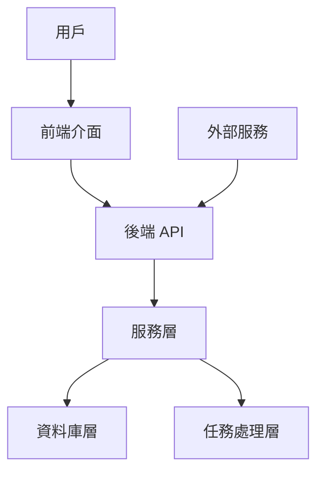
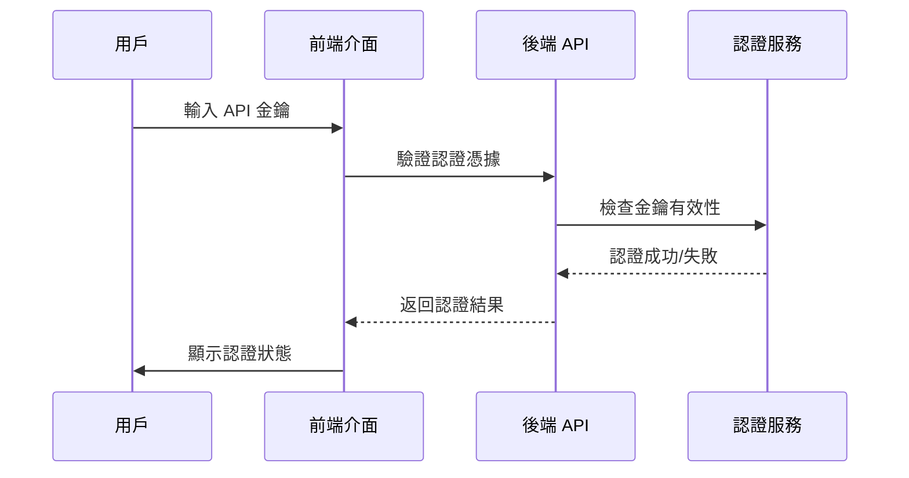
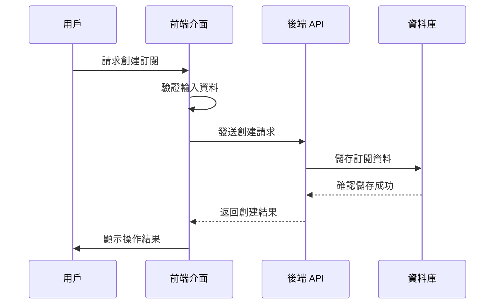
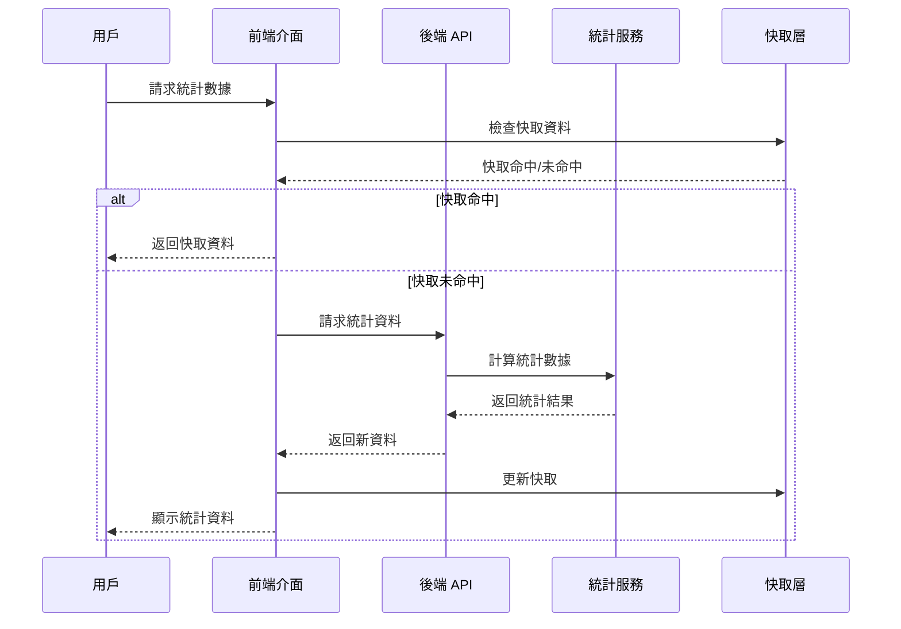

# 前端管理介面技術設計文檔

## 概述

### 目的
這個前端管理介面為現有的 Webhook Gateway 後端系統提供現代化的圖形用戶介面，使用戶能夠通過直觀的視覺介面管理 webhook 來源、主題、訂閱，並監控系統統計數據和事件日誌。

### 使用者
系統管理員和開發人員將利用此介面進行以下工作流程：
- 設定和管理 webhook 來源和驗證憑據
- 創建和配置主題以分類 webhook 事件
- 管理訂閱以控制事件分發目標
- 監控系統統計數據和健康狀態
- 查看和分析事件日誌進行故障排除

### 影響
這個前端介面改變了當前純 API 的系統設計，提供了一個視覺化的管理層，顯著提升了系統的操作便利性和用戶體驗，從純命令列/ API 調用轉變為圖形化管理介面。

### 目標
- 提供直觀的 webhook 資源管理介面
- 實現即時統計數據視覺化和監控
- 支援高效的事件日誌查詢和分析
- 確保與現有後端 API 的無縫整合
- 建立響應式設計支援多種設備訪問

### 非目標
- 不負責 webhook 事件的實際處理邏輯（這由後端系統處理）
- 不提供即時通訊或聊天功能
- 不處理複雜的業務邏輯運算（專注於資源管理和監控）
- 不支援離線模式下的資料操作

## 架構

### 現有架構分析
當前系統採用 API 優先設計模式，專注於提供穩定的 REST API 服務。後端採用分層架構：
- API 層：處理 HTTP 請求和響應路由
- 服務層：封裝業務邏輯和資料操作
- 資料庫層：提供資料持久化和查詢功能
- 任務處理層：負責異步事件處理和分發

前端介面將作為一個新的展示層加入，與現有的後端架構完全解耦，僅通過 REST API 進行通訊。

### 高層級架構



### 架構整合
- **現有模式保留**：維持後端的 API 優先設計和分層架構
- **新元件理由**：前端介面作為獨立的展示層，提供視覺化管理功能
- **技術一致性**：前端採用現代 JavaScript 生態系統，與後端的技術棧互補
- **指導方針遵循**：設計遵循模組化、可測試、可維護的原則

### 技術棧和設計決策

#### 前端技術棧
- **React 18+**: 選擇 React 而非 Vue.js，因為其龐大的生態系統和成熟的開發工具支援
- **TypeScript**: 提供靜態類型檢查，提高程式碼品質和開發效率
- **Vite**: 現代建置工具，提供快速的開發體驗和優化的生產建置
- **React Router v6**: 客戶端路由管理，提供單頁應用程式體驗
- **Zustand**: 輕量級狀態管理，避免 Redux 的複雜性
- **React Hook Form**: 高效的表單處理和驗證
- **Axios**: HTTP 客戶端，提供請求攔截和錯誤處理
- **Chart.js + React-Chartjs-2**: 統計數據視覺化
- **Tailwind CSS**: 實用優先的 CSS 框架，提供快速樣式開發
- **Headless UI**: 無障礙的基礎 UI 元件庫

#### 關鍵設計決策

**決策：採用 React + TypeScript 技術棧**
- **背景**：需要為複雜的管理介面選擇成熟的技術棧
- **替代方案**：考慮過 Vue.js、Angular 和 Svelte
- **選擇方案**：React + TypeScript 提供最佳的生態系統支援和開發體驗
- **理由**：React 的組件化架構完美支援複雜 UI，TypeScript 提升程式碼品質，龐大的開源生態系統加速開發
- **權衡**：學習曲線稍陡峭但長期維護效益更高

**決策：採用元件驅動開發模式**
- **背景**：需要管理複雜的狀態和用戶互動
- **替代方案**：類別元件、函數元件 + useState、Redux 狀態管理
- **選擇方案**：現代 React Hooks + Zustand 狀態管理
- **理由**：Hooks 提供更好的程式碼重用性，Zustand 簡化狀態管理邏輯
- **權衡**：需要適應新的思維模式但提供更好的開發體驗

**決策：實作響應式設計優先**
- **背景**：用戶可能在不同設備上訪問介面
- **替代方案**：桌面優先設計、行動優先設計、自適應設計
- **選擇方案**：行動優先的響應式設計
- **理由**：現代用戶習慣行動優先，Tailwind CSS 提供優秀的響應式支援
- **權衡**：開發複雜度稍增但提供更好的跨平台體驗

## 系統流程

### 用戶認證流程



### 訂閱管理操作流程



### 統計數據載入流程



## 需求追蹤性

### 功能需求追蹤

| 需求編號 | 需求摘要 | 技術元件 | 介面設計 | 流程圖 |
|---------|---------|---------|---------|-------|
| 1.1 | Bearer Token 認證整合 | 認證模組 | AuthProvider 元件 | 用戶認證流程 |
| 1.2 | 會話狀態管理 | 認證模組 | TokenStorage 服務 | 用戶認證流程 |
| 2.1 | 系統總覽統計顯示 | 儀表板模組 | Dashboard 元件 | 統計數據載入流程 |
| 2.2 | 即時數據更新 | 儀表板模組 | WebSocket/Realtime 服務 | 統計數據載入流程 |
| 3.1 | 來源資源 CRUD 操作 | 資源管理模組 | SourceManagement 元件 | 訂閱管理操作流程 |
| 3.2 | 多種驗證類型支援 | 資源管理模組 | SignatureValidator 組態 | 訂閱管理操作流程 |
| 4.1 | 主題資源管理 | 資源管理模組 | TopicManagement 元件 | 訂閱管理操作流程 |
| 5.1 | 訂閱生命週期管理 | 資源管理模組 | SubscriptionManagement 元件 | 訂閱管理操作流程 |
| 5.2 | 批量操作支援 | 資源管理模組 | BulkOperations 服務 | 訂閱管理操作流程 |
| 6.1 | 多維度統計視覺化 | 統計模組 | ChartVisualization 元件 | 統計數據載入流程 |
| 6.2 | 數據匯出功能 | 統計模組 | ExportService 服務 | 統計數據載入流程 |
| 7.1 | 事件日誌查詢 | 日誌模組 | LogViewer 元件 | 日誌查詢流程 |
| 7.2 | 即時日誌監控 | 日誌模組 | RealtimeLog 服務 | 日誌查詢流程 |

### 非功能需求追蹤

| 需求類型 | 需求摘要 | 技術實現 | 設計考量 |
|---------|---------|---------|---------|
| 用戶體驗 | 響應式設計 | Tailwind CSS + 行動優先設計 | 多設備適配和觸控友好 |
| 技術架構 | React + TypeScript | 靜態類型檢查和元件架構 | 程式碼品質和開發效率 |
| 性能 | 載入時間 < 2秒 | 程式碼分割和快取策略 | 用戶體驗優化 |
| 安全性 | 認證保護 | Token 基礎認證和輸入驗證 | 資料保護和授權控制 |
| 錯誤處理 | 用戶友好錯誤訊息 | 全域錯誤處理和回復機制 | 用戶體驗和系統穩定性 |

## 元件和介面

### 前端應用層

#### 應用容器 (App Container)

**責任與邊界**
- **主要責任**：提供頂層應用程式結構和路由配置
- **領域邊界**：前端展示層的頂層組織者
- **資料擁有權**：管理全域應用程式狀態和設定
- **交易邊界**：不涉及交易操作，專注於 UI 狀態管理

**依賴關係**
- **輸入依賴**：路由配置和元件結構定義
- **輸出依賴**：狀態管理庫和 UI 框架
- **外部依賴**：React Router、Zustand 狀態管理

**契約定義**

**服務介面**
```typescript
interface AppContainerService {
  initialize(): Promise<ApplicationState>;
  configureRouting(): RouterConfiguration;
  setupGlobalState(): GlobalStateManager;
  handleError(error: Error): ErrorBoundaryResult;
}
```

- **前提條件**：React 應用程式環境已準備就緒
- **後置條件**：應用程式成功初始化並可進行用戶互動
- **不變量**：應用程式結構和狀態管理邏輯保持一致

#### 認證供應者 (Authentication Provider)

**責任與邊界**
- **主要責任**：管理用戶認證狀態和授權檢查
- **領域邊界**：認證和授權領域
- **資料擁有權**：用戶認證令牌和會話資訊
- **交易邊界**：認證狀態的原子性更新操作

**依賴關係**
- **輸入依賴**：API 金鑰驗證服務
- **輸出依賴**：認證狀態消費者元件
- **外部依賴**：JWT 令牌處理庫、安全儲存服務

**契約定義**

**服務介面**
```typescript
interface AuthenticationService {
  authenticate(credentials: ApiKeyCredentials): Promise<AuthenticationResult>;
  refreshToken(): Promise<TokenRefreshResult>;
  logout(): Promise<void>;
  isAuthenticated(): boolean;
  getCurrentUser(): UserProfile | null;
}
```

- **前提條件**：有效的 API 金鑰格式
- **後置條件**：認證狀態正確更新，用戶可訪問授權資源
- **不變量**：認證狀態始終保持一致性和安全性

### 功能模組層

#### 儀表板模組 (Dashboard Module)

**責任與邊界**
- **主要責任**：顯示系統總覽統計和關鍵指標
- **領域邊界**：統計數據展示領域
- **資料擁有權**：儀表板顯示資料和快取資訊
- **交易邊界**：統計資料的非交易性讀取操作

**依賴關係**
- **輸入依賴**：統計服務和資料獲取元件
- **輸出依賴**：圖表視覺化元件
- **外部依賴**：Chart.js 圖表庫、日期處理庫

**契約定義**

**API 契約**
| 方法 | 端點 | 請求 | 響應 | 錯誤 |
|------|------|------|------|------|
| GET | /api/v1/stats/overview | - | SystemOverview | 401, 500 |
| GET | /api/v1/stats/activity | QueryParams | ActivityStats | 401, 500 |

**服務介面**
```typescript
interface DashboardService {
  loadOverviewStats(): Promise<SystemOverview>;
  loadActivityStats(timeRange: TimeRange): Promise<ActivityStats>;
  refreshData(): Promise<void>;
}
```

#### 資源管理模組 (Resource Management Module)

**責任與邊界**
- **主要責任**：管理 webhook 資源的 CRUD 操作
- **領域邊界**：資源管理領域（來源、主題、訂閱）
- **資料擁有權**：資源資料狀態和表單輸入資料
- **交易邊界**：資源建立、更新、刪除的原子性操作

**依賴關係**
- **輸入依賴**：表單驗證和資料轉換服務
- **輸出依賴**：資源列表和詳情顯示元件
- **外部依賴**：React Hook Form、日期格式化庫

**契約定義**

**服務介面**
```typescript
interface ResourceManagementService {
  createResource(type: ResourceType, data: CreateResourceData): Promise<Resource>;
  updateResource(id: string, data: UpdateResourceData): Promise<Resource>;
  deleteResource(id: string): Promise<void>;
  listResources(type: ResourceType, filters: ResourceFilters): Promise<ResourceList>;
  getResourceDetails(id: string): Promise<ResourceDetails>;
}
```

- **前提條件**：有效的資源資料格式和必要欄位
- **後置條件**：資源狀態正確更新並反映到使用者介面
- **不變量**：資源資料的一致性和完整性

#### 統計視覺化模組 (Statistics Visualization Module)

**責任與邊界**
- **主要責任**：將統計資料轉換為視覺化圖表和圖形
- **領域邊界**：資料視覺化領域
- **資料擁有權**：圖表設定和視覺化狀態
- **交易邊界**：非交易性資料轉換和呈現操作

**依賴關係**
- **輸入依賴**：統計資料服務和格式轉換器
- **輸出依賴**：圖表渲染元件和匯出服務
- **外部依賴**：Chart.js、圖表匯出庫、顏色主題庫

**契約定義**

**服務介面**
```typescript
interface StatisticsVisualizationService {
  createChart(type: ChartType, data: ChartData): ChartConfiguration;
  updateChart(id: string, data: ChartData): void;
  exportChart(format: ExportFormat): Promise<Blob>;
  applyTheme(theme: ChartTheme): void;
}
```

#### 日誌檢視模組 (Log Viewer Module)

**責任與邊界**
- **主要責任**：查詢、過濾和顯示事件日誌資料
- **領域邊界**：日誌分析和故障排除領域
- **資料擁有權**：日誌查詢參數和顯示設定
- **交易邊界**：非交易性日誌資料讀取操作

**依賴關係**
- **輸入依賴**：日誌查詢服務和搜尋過濾器
- **輸出依賴**：日誌列表和詳情顯示元件
- **外部依賴**：日期範圍選擇器、搜尋過濾器、虛擬滾動庫

**契約定義**

**API 契約**
| 方法 | 端點 | 請求 | 響應 | 錯誤 |
|------|------|------|------|------|
| GET | /api/v1/logs/ | QueryParams | EventLogList | 401, 500 |

**服務介面**
```typescript
interface LogViewerService {
  searchLogs(filters: LogFilters): Promise<EventLogList>;
  loadMoreLogs(page: number): Promise<EventLogList>;
  getLogDetails(id: string): Promise<EventLogDetails>;
}
```

### 共用服務層

#### API 客戶端服務 (API Client Service)

**責任與邊界**
- **主要責任**：封裝所有後端 API 通訊邏輯
- **領域邊界**：API 通訊領域
- **資料擁有權**：請求/響應攔截和錯誤處理設定
- **交易邊界**：非交易性 HTTP 請求處理

**依賴關係**
- **輸入依賴**：認證服務和請求設定
- **輸出依賴**：所有業務服務模組
- **外部依賴**：Axios HTTP 客戶端、請求攔截器

**契約定義**

**服務介面**
```typescript
interface ApiClientService {
  get<T>(url: string, config?: RequestConfig): Promise<ApiResponse<T>>;
  post<T>(url: string, data?: any, config?: RequestConfig): Promise<ApiResponse<T>>;
  put<T>(url: string, data?: any, config?: RequestConfig): Promise<ApiResponse<T>>;
  delete<T>(url: string, config?: RequestConfig): Promise<ApiResponse<T>>;
}
```

#### 快取服務 (Cache Service)

**責任與邊界**
- **主要責任**：管理應用程式資料快取策略
- **領域邊界**：資料快取領域
- **資料擁有權**：快取資料和失效策略設定
- **交易邊界**：非交易性快取操作

**依賴關係**
- **輸入依賴**：資料儲存介面和失效策略
- **輸出依賴**：所有需要快取資料的服務
- **外部依賴**：瀏覽器儲存 API、記憶體快取庫

**契約定義**

**服務介面**
```typescript
interface CacheService {
  get<T>(key: string): T | null;
  set<T>(key: string, value: T, ttl?: number): void;
  delete(key: string): void;
  clear(): void;
}
```

## 資料模型

### 領域模型

#### 資源領域模型
資源領域包含 webhook 管理的核心概念，包括來源、主題和訂閱。

**核心概念**：
- **來源聚合**：管理 webhook 來源及其驗證設定
- **主題實體**：表示可訂閱的事件類型
- **訂閱實體**：定義事件分發目標和設定
- **資源事件**：記錄資源狀態變更的操作歷史

**業務規則與不變量**：
- 來源名稱必須唯一且格式正確
- 主題必須關聯到有效的來源
- 訂閱必須指定有效的目標 URL
- 資源操作必須記錄審計日誌

#### 統計領域模型
統計領域負責收集和計算系統使用指標。

**核心概念**：
- **統計匯總**：不同時間維度的資料彙總
- **活動指標**：系統活動和效能測量
- **健康狀態**：系統各元件的運作狀態

**業務規則與不變量**：
- 統計計算必須基於準確的時間範圍
- 健康檢查必須涵蓋所有關鍵元件
- 指標資料必須定期更新以反映最新狀態

### 邏輯資料模型

#### 前端狀態模型
定義前端應用程式中各元件的狀態結構。

**結構定義**：
- 認證狀態：包含令牌資訊和過期時間
- 資源狀態：包含資源列表和當前選擇項目
- 統計狀態：包含各種統計資料和載入狀態
- UI 狀態：包含使用者介面設定和偏好

**一致性與完整性**：
- 狀態更新必須保持資料一致性
- 載入狀態必須正確反映非同步操作進度
- 錯誤狀態必須包含足夠的錯誤資訊進行處理

### 資料契約與整合

#### API 資料傳輸
定義與後端 API 之間的資料交換格式。

**請求/響應模式**：
- 資源建立：包含必要欄位和驗證規則
- 資源查詢：支援分頁和過濾參數
- 統計查詢：支援時間範圍和匯總選項
- 錯誤響應：統一的錯誤格式和錯誤碼

**驗證規則**：
- 必要欄位驗證：確保關鍵資料存在
- 格式驗證：檢查資料格式正確性
- 業務規則驗證：確保資料符合業務邏輯

**序列化格式**：
- JSON：主要資料交換格式
- 日期格式：ISO 8601 標準格式
- 數字格式：支援整數和浮點數類型

## 錯誤處理

### 錯誤策略
採用分層錯誤處理策略，對不同類型的錯誤採用適當的處理機制。

### 錯誤類別與響應

**用戶錯誤 (4xx)**：
- 無效輸入：欄位層級驗證錯誤顯示，提供具體欄位錯誤資訊和修正建議
- 未授權：引導用戶重新認證，提供認證失敗原因說明
- 資源不存在：顯示友善的「資源不存在」頁面，提供導航幫助和替代選項

**系統錯誤 (5xx)**：
- 基礎設施故障：顯示服務暫時不可用頁面，提供預計恢復時間
- 逾時錯誤：實作電路斷路器模式，顯示暫時性錯誤並自動重試
- 資源耗盡：實作速率限制，提供清楚的限制說明和建議

**業務邏輯錯誤 (422)**：
- 規則違反：顯示具體的業務規則說明和建議的修正方式
- 狀態衝突：引導用戶解決狀態衝突，提供狀態轉換選項

### 監控
實作全方位的錯誤追蹤和監控機制：
- 錯誤日誌記錄：記錄所有錯誤的詳細資訊和發生環境
- 使用者體驗監控：追蹤錯誤對用戶體驗的影響
- 效能監控：監控錯誤處理對系統效能的影響

## 測試策略

### 單元測試
專注於測試個別元件和服務的正確性：
- 認證服務測試：驗證令牌處理和會話管理邏輯
- 資源服務測試：測試資源 CRUD 操作的業務邏輯
- 表單驗證測試：驗證輸入驗證規則的正確實作
- 工具函數測試：測試共用工具函數的邊界情況
- 狀態管理測試：驗證狀態更新和資料流邏輯

### 整合測試
測試元件之間的互動和資料流：
- API 整合測試：驗證前端與後端 API 的正確互動
- 狀態管理整合測試：測試狀態變化在元件間的傳播
- 路由整合測試：驗證頁面導航和參數傳遞
- 錯誤處理整合測試：測試錯誤在元件間的處理流程

### 端到端測試
驗證完整的使用者工作流程：
- 認證流程測試：從登入到登出的完整認證體驗
- 資源管理測試：資源建立、編輯、刪除的完整生命週期
- 統計檢視測試：統計資料載入和視覺化的完整流程
- 日誌查詢測試：日誌搜尋、過濾、詳情檢視的完整功能

### 效能測試
確保應用程式在各種條件下的效能表現：
- 載入效能測試：測試頁面載入時間和資源使用情況
- 並發使用者測試：驗證多使用者同時操作的系統行為
- 大資料量測試：測試處理大量資料時的應用程式效能
- 記憶體洩漏測試：確保長期使用不會造成記憶體問題

## 安全性考量

### 威脅建模
識別並評估潛在的安全威脅：
- 未授權訪問：透過適當的認證機制防止
- 資料竊取：使用 HTTPS 和安全的資料儲存保護敏感資訊
- 跨站腳本攻擊：實作內容安全政策和輸入清理
- 請求偽造：實作適當的 CSRF 保護機制

### 安全控制
實作多層安全控制機制：
- 認證和授權：基於角色的訪問控制系統
- 輸入驗證：嚴格的輸入驗證和清理機制
- 資料保護：敏感資料的加密儲存和傳輸保護
- 錯誤處理：避免在錯誤訊息中暴露敏感系統資訊

### 合規要求
確保系統符合相關的安全標準和隱私法規：
- 資料保護：遵循個人資料保護原則
- 審計追蹤：記錄所有安全相關的操作
- 存取控制：實作最小權限原則

## 效能與擴充性

### 目標指標
定義明確的效能目標和測量策略：
- 頁面載入時間：首頁載入時間小於 2 秒
- API 響應時間：一般操作響應時間小於 500 毫秒
- 記憶體使用：控制記憶體消耗，避免記憶體洩漏
- 網路優化：實作智慧快取和請求去重機制

### 擴充策略
設計支援未來成長的架構：
- 水平擴充：支援多個前端實例部署
- 載入平衡：實作智慧的載入分配機制
- 快取策略：多層快取架構提升效能
- 程式碼分割：按需載入減少初始包大小

### 優化技術
運用現代前端優化技術：
- 虛擬滾動：處理大量資料列表的高效渲染
- 記憶體管理：實作適當的記憶體清理機制
- 圖片優化：使用現代圖片格式和懶載入技術
- 套件優化：使用樹搖和程式碼分割減少包大小
