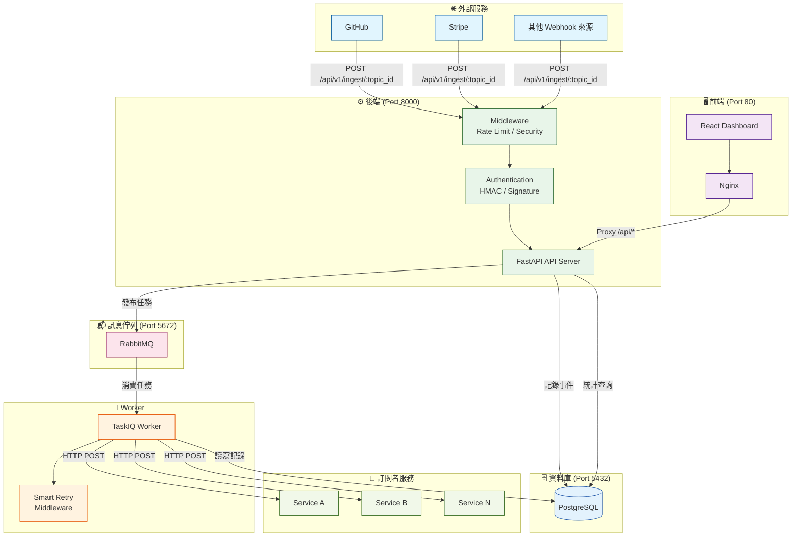
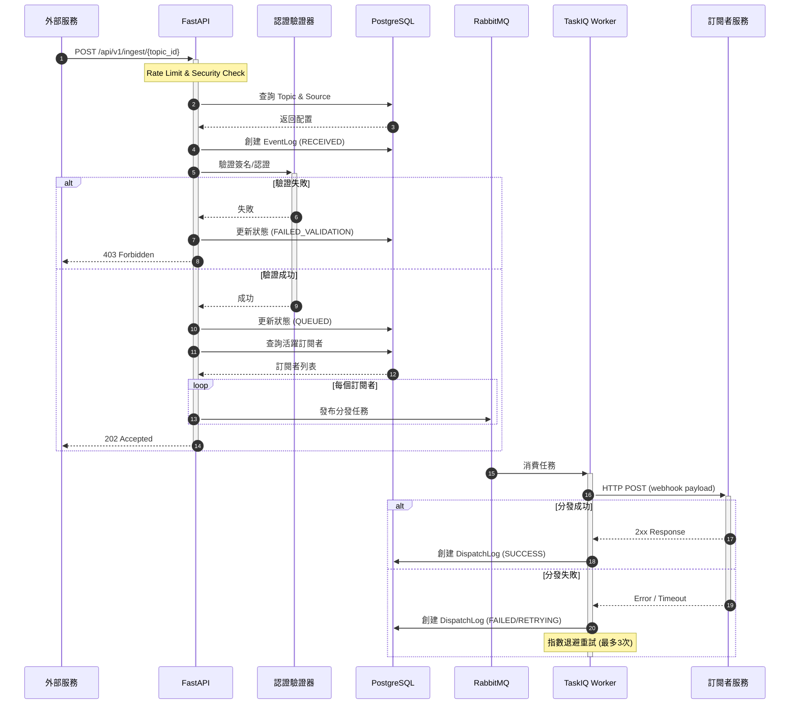
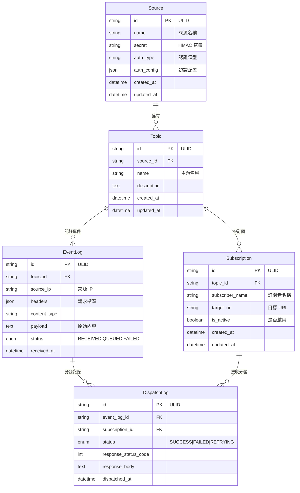
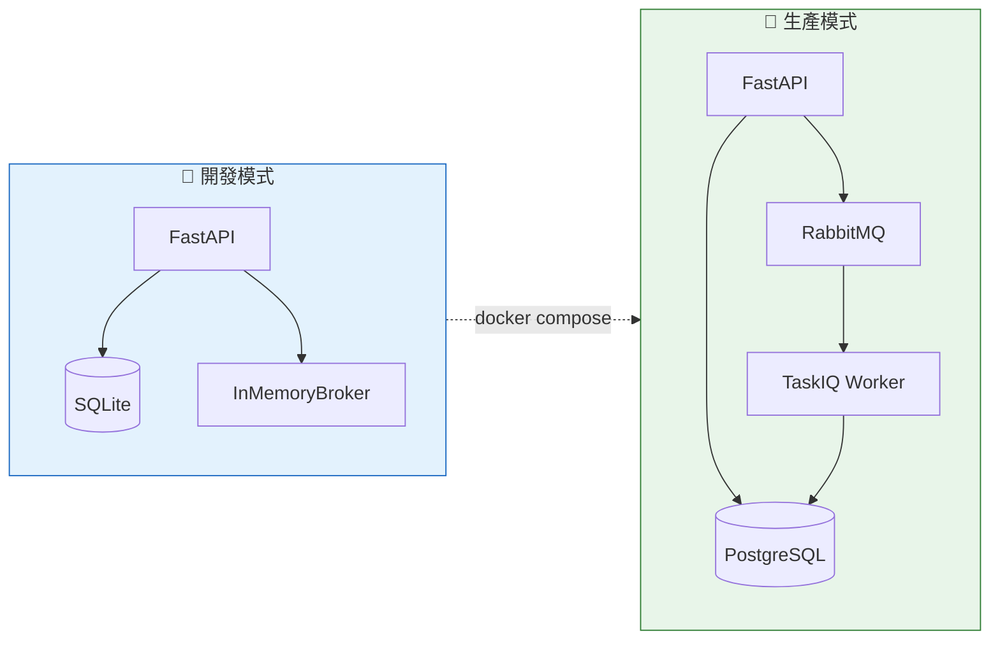

# 🚀 Webhook Gateway

一個強大且可擴展的 Webhook 網關系統，專為接收、驗證、處理和分發來自各種來源的 webhook 事件而設計。

[](https://python.org)
[](https://fastapi.tiangolo.com)
[](https://postgresql.org)
[](https://docker.com)

## ✨ 特色功能

- 🔄 **異步處理**：使用 TaskIQ 和 RabbitMQ 進行高效的異步事件處理
- 📡 **多格式支援**：支援 JSON、XML 和 form-data 格式的 webhook
- 🔒 **安全驗證**：內建 HMAC 簽名驗證機制 (GitHub, Stripe 等)
- 📊 **即時統計**：提供詳細的統計數據和 Prometheus 監控指標
- 🐳 **完整部署**：包含前端儀表板、後端 API、資料庫與訊息佇列的 Docker Compose 配置

## 🚀 快速開始

### 使用 Docker (推薦)

```bash
# 1. 克隆專案
git clone <repository-url>
cd webhook-dev

# 2. 啟動所有服務 (Frontend, Backend, Postgres, RabbitMQ)
docker compose up --build -d
```

### 服務位置

- **Frontend Dashboard**: http://localhost
- **API Server**: http://localhost:8000
- **API Docs**: http://localhost:8000/docs
- **RabbitMQ Management**: http://localhost:15672

## 📚 文檔

- [安裝與配置指南](./docs/setup.md)
- [API 使用指南](./docs/usage.md)

## 🏗️ 架構

- **Frontend**: React + Vite (Nginx 部署)
- **Backend**: FastAPI
- **Database**: PostgreSQL (替換了原有的 MySQL)
- **Queue**: RabbitMQ
- **Worker**: TaskIQ

### 系統架構圖



### Webhook 處理流程



### 資料模型關係圖



### 開發/生產模式對比



## 📄 授權

MIT License
