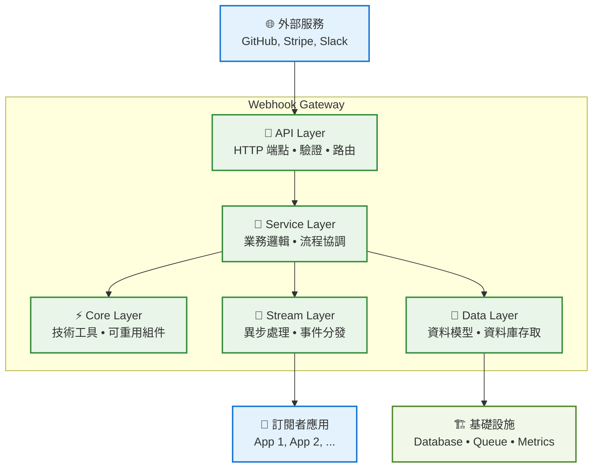
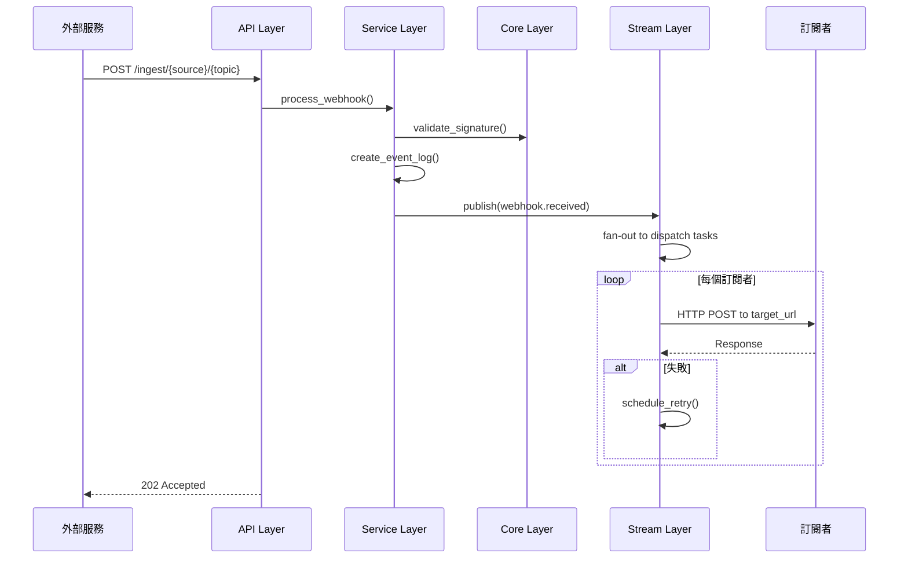

# Webhook Gateway 系統架構

本文件說明系統的分層架構設計與開發指南，讓開發者快速了解「程式碼應該寫在哪一層」。

## 📋 目錄

1. [分層架構](#分層架構)
2. [開發指南](#開發指南)
3. [資料流程](#資料流程)
4. [擴展範例](#擴展範例)

---

## 🏗️ 分層架構

系統採用 **分層架構**，每層都有明確職責。依賴方向：`API → Service → Core ← Data`

### 分層架構圖



---

## 🧭 開發指南

### 層級職責簡表

| 層級 | 職責 | 適合寫什麼 | 不適合寫什麼 |
|------|------|------------|---------------|
| **API** | HTTP 介面 | 端點、驗證、狀態碼 | 業務邏輯、資料庫操作 |
| **Service** | 業務邏輯 | 流程、事務、整合 | HTTP 處理、技術工具 |
| **Core** | 技術工具 | 可重用函數、算法 | 特定業務、HTTP 處理 |
| **Stream** | 異步處理 | 事件、佇列、重試 | 同步 API、即時回應 |
| **Data** | 資料存取 | 模型、關聯、連線 | 業務邏輯、HTTP 處理 |

---

## 🔄 資料流程



## 🚀 擴展範例

### 新增 Webhook Source

**步驟：**
1. 在 `app/core/signature/strategies.py` 新增策略
2. 在 `app/main.py` 註冊策略
3. 建立 Source 與 Topic 記錄
4. 測試端點

**範例：新增 Discord 支援**
```python
# 1. 新增策略
class DiscordSignatureStrategy(SignatureStrategy):
    def get_signature_header_key(self) -> str:
        return "discord"

    def verify(self, body: bytes, signature: str, secret: str) -> bool:
        # Discord 簽名驗證邏輯
        pass

# 2. 註冊策略
webhook_service.signature_validator.register_strategy("discord", DiscordSignatureStrategy())

# 3. 建立記錄（透過 API 或直接資料庫）
# POST /api/v1/manage/sources/
# {"name": "discord", "secret": "your-discord-secret"}

# 4. 測試
# POST /api/v1/ingest/discord/message
```

### 常見開發任務對照

| 需求 | 層級 | 檔案 |
|------|------|------|
| 新增 API 端點 | API | `api/v1/endpoints/` |
| 新增業務功能 | Service | `services/` |
| 新增簽名驗證 | Core | `core/signature/strategies.py` |
| 新增資料表 | Data | `db/models.py` |
| 新增異步任務 | Stream | `stream/handlers.py` |

---

**核心原則：每層專注自己的職責，透過明確介面溝通。**
