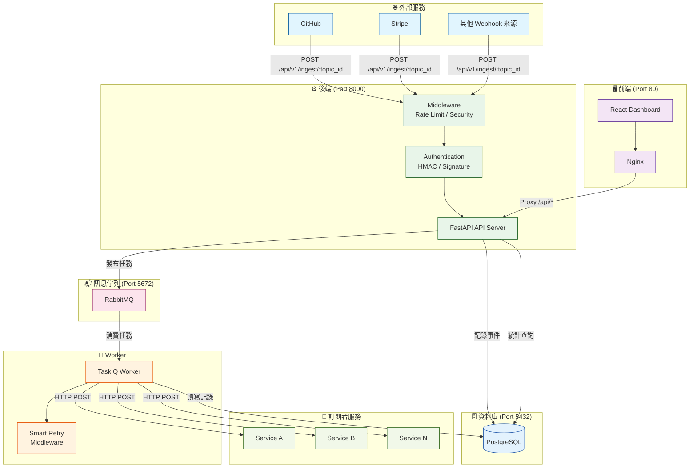
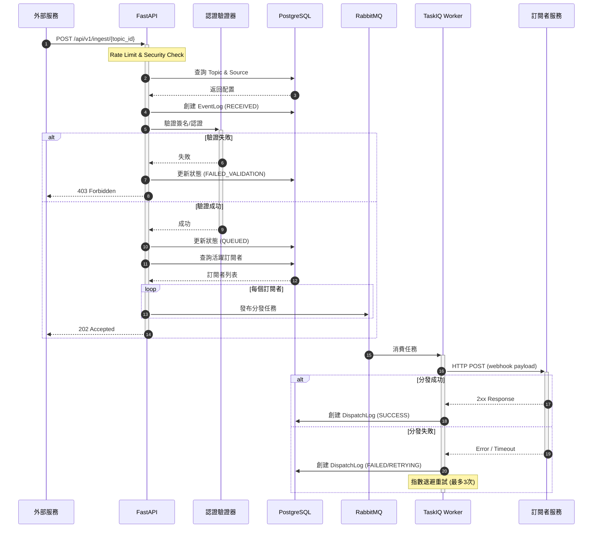
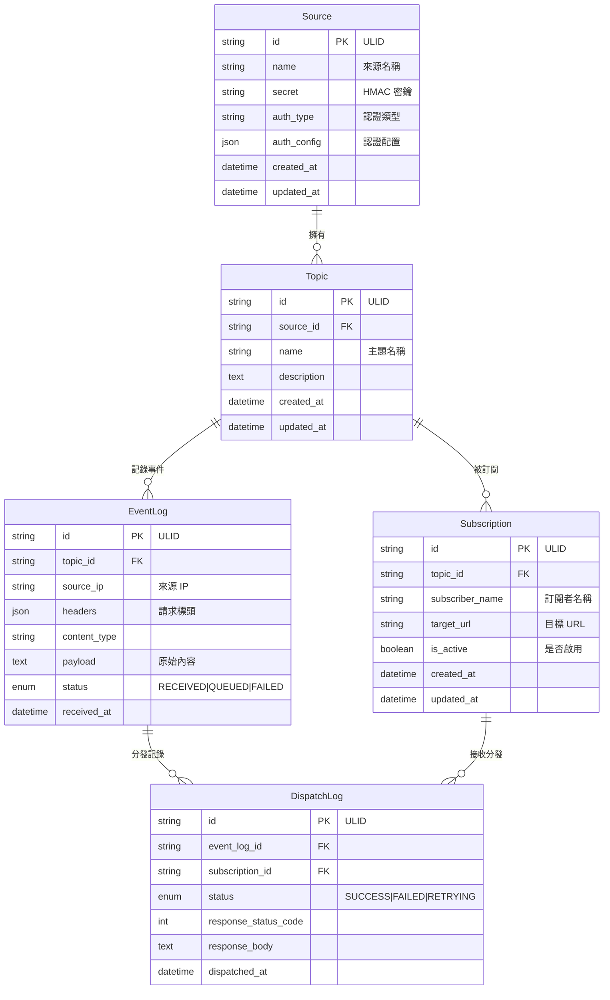
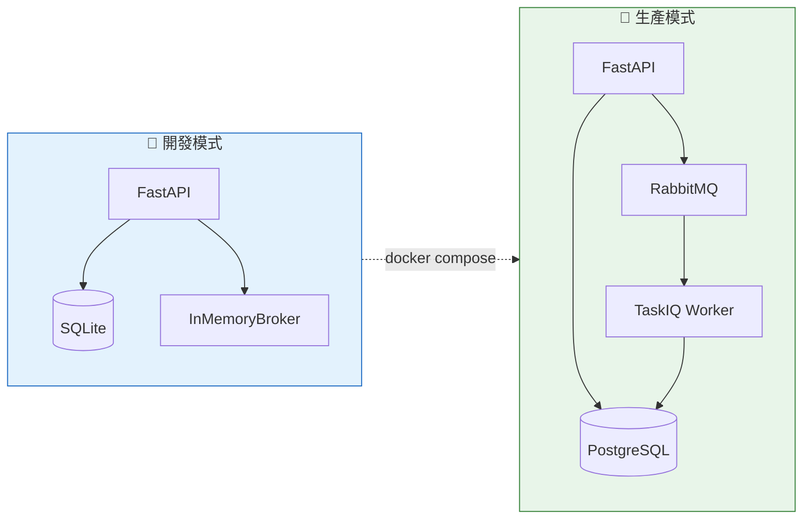

# 🏗️ 系統架構與 Codebase 導覽

本文件詳細說明 Webhook Gateway 的系統架構、處理流程和程式碼結構。

## 目錄

- [系統架構圖](#系統架構圖)
- [Webhook 處理流程](#webhook-處理流程)
- [資料模型關係圖](#資料模型關係圖)
- [開發/生產模式對比](#開發生產模式對比)
- [Codebase 導覽](#codebase-導覽)

---

## 系統架構圖



---

## Webhook 處理流程



---

## 資料模型關係圖



---

## 開發/生產模式對比



| 項目 | 開發模式 | 生產模式 |
|------|----------|----------|
| 資料庫 | SQLite | PostgreSQL |
| 訊息佇列 | InMemoryBroker | RabbitMQ |
| Worker | 不需要 (同步處理) | TaskIQ Worker |
| 配置檔 | `example.env` | `example.prod.env` |

---

## Codebase 導覽

### 專案結構總覽

```
webhook-dev/
├── app/                    # 🐍 Python 後端 (FastAPI)
│   ├── api/                #    API 路由層
│   ├── core/               #    核心配置與工具
│   ├── db/                 #    資料庫模型與連線
│   ├── middleware/         #    中介軟體
│   ├── monitoring/         #    監控與指標
│   ├── schemas/            #    Pydantic 資料模型
│   ├── services/           #    業務邏輯層
│   ├── taskiq/             #    背景任務處理
│   └── main.py             #    應用程式入口
├── frontend/               # ⚛️ React 前端
│   └── src/
│       ├── components/     #    UI 元件
│       ├── services/       #    API 客戶端
│       ├── types/          #    TypeScript 型別
│       └── hooks/          #    React Hooks
├── tests/                  # 🧪 測試檔案
├── docs/                   # 📚 文件
├── config/                 # ⚙️ 服務配置 (MySQL, RabbitMQ)
└── scripts/                # 🔧 開發腳本
```

---

### 🐍 後端 (`app/`)

#### `app/api/` - API 路由層

| 檔案 | 說明 |
|------|------|
| `v1/endpoints/ingest.py` | **Webhook 接收端點** - 接收外部 webhook 請求 (`POST /api/v1/ingest/{topic_id}`) |
| `v1/endpoints/topics.py` | **主題管理 API** - CRUD 操作、來源 (Source) 管理 |
| `v1/endpoints/subscriptions.py` | **訂閱管理 API** - 訂閱者的 CRUD 操作 |
| `v1/endpoints/logs.py` | **日誌查詢 API** - 查詢事件與分發記錄 |
| `v1/endpoints/stats.py` | **統計數據 API** - 儀表板統計資料 |
| `v1/deps.py` | **依賴注入** - API 金鑰驗證、資料庫會話 |

#### `app/core/` - 核心配置與工具

| 檔案/目錄 | 說明 |
|-----------|------|
| `config.py` | **應用配置** - 使用 Pydantic Settings 管理環境變數 |
| `authentication/` | **認證模組** - 支援多種簽名驗證策略 |
| ├── `validator.py` | 認證驗證器主類別 |
| ├── `strategies/signature.py` | HMAC 簽名驗證 (GitHub, Stripe 格式) |
| └── `strategies/none.py` | 無認證策略 |
| `error_handler.py` | **統一錯誤處理** - 自訂例外處理器 |
| `exceptions.py` | **自訂例外類別** |
| `ids.py` | **ID 生成器** - ULID 生成工具 |

#### `app/services/` - 業務邏輯層

| 檔案 | 說明 |
|------|------|
| `webhook_service.py` | **核心服務** - Webhook 接收、驗證、發布任務 |
| `topic_service.py` | 主題與來源的 CRUD 業務邏輯 |
| `subscription_service.py` | 訂閱管理業務邏輯 |
| `log_service.py` | 事件日誌記錄服務 |
| `stats_service.py` | 統計數據計算服務 |

#### `app/db/` - 資料庫層

| 檔案 | 說明 |
|------|------|
| `models.py` | **SQLAlchemy 模型** - Source, Topic, Subscription, EventLog, DispatchLog |
| `session.py` | **資料庫連線** - 異步引擎與會話管理 |
| `base.py` | SQLAlchemy Base 類別 |

#### `app/taskiq/` - 背景任務

| 檔案 | 說明 |
|------|------|
| `broker_manager.py` | **Broker 管理器** - 自動切換 InMemoryBroker / RabbitMQ |
| `tasks.py` | **任務定義** - `send_webhook_to_subscription` 分發任務 |

#### `app/middleware/` - 中介軟體

| 檔案 | 說明 |
|------|------|
| `security.py` | **安全中介** - Rate Limiting、重放攻擊防護 |

#### `app/schemas/` - 資料傳輸物件

| 檔案 | 說明 |
|------|------|
| `source.py` | Source 的請求/響應模型 |
| `topic.py` | Topic 的請求/響應模型 |
| `subscription.py` | Subscription 的請求/響應模型 |
| `log.py` | Log 查詢的請求/響應模型 |

---

### ⚛️ 前端 (`frontend/src/`)

#### 元件 (`components/`)

| 元件 | 說明 |
|------|------|
| `Layout.tsx` | 主版面配置 (側邊欄 + 主內容區) |
| `LoginForm.tsx` | 登入表單 |
| `ProtectedRoute.tsx` | 路由保護 (認證檢查) |
| **來源管理** | |
| `SourceList.tsx` | 來源列表 |
| `SourceDetail.tsx` | 來源詳情 |
| `SourceForm.tsx` / `SourceEdit.tsx` | 來源新增/編輯表單 |
| **主題管理** | |
| `TopicList.tsx` | 主題列表 |
| `TopicDetail.tsx` | 主題詳情 |
| `TopicForm.tsx` / `TopicEdit.tsx` | 主題新增/編輯表單 |
| **訂閱管理** | |
| `SubscriptionList.tsx` | 訂閱列表 |
| `SubscriptionDetail.tsx` | 訂閱詳情 |
| `SubscriptionForm.tsx` / `SubscriptionEdit.tsx` | 訂閱新增/編輯表單 |
| **日誌與統計** | |
| `LogViewer.tsx` / `LogList.tsx` | 日誌檢視器 |
| `LogDetail.tsx` | 日誌詳情 |
| `StatCard.tsx` | 統計卡片 |
| `ActivityChart.tsx` | 活動圖表 |
| `StatsOverviewChart.tsx` | 統計總覽圖表 |

#### 服務 (`services/`)

| 檔案 | 說明 |
|------|------|
| `authService.ts` | 認證服務 (登入/登出) |
| `sourceService.ts` | Source API 客戶端 |
| `topicService.ts` | Topic API 客戶端 |
| `subscriptionService.ts` | Subscription API 客戶端 |
| `logService.ts` | Log API 客戶端 |
| `statsService.ts` | 統計 API 客戶端 |
| `dashboardService.ts` | 儀表板資料整合 |
| `secureStorage.ts` | 安全存儲 (Token 管理) |

#### 型別定義 (`types/`)

| 檔案 | 說明 |
|------|------|
| `source.ts` | Source 相關型別 |
| `topic.ts` | Topic 相關型別 |
| `subscription.ts` | Subscription 相關型別 |
| `log.ts` | Log 相關型別 |
| `stats.ts` | 統計相關型別 |
| `dashboard.ts` | 儀表板相關型別 |

---

### 🔧 開發腳本 (`scripts/`)

| 檔案 | 說明 |
|------|------|
| `setup_test_data.py` | 初始化測試資料 |
| `e2e_webhook_test.py` | 端到端 webhook 測試 |
| `webhook_demo.py` | Webhook 發送示範 |
| `webhook_debug.py` | Webhook 除錯工具 |
| `subscriptions_api_demo.py` | 訂閱 API 示範 |

---

### 📁 重要配置檔案

| 檔案 | 說明 |
|------|------|
| `docker-compose.yml` | Docker 服務編排 (API, Worker, DB, RabbitMQ, Frontend) |
| `Dockerfile` | 後端 Docker 映像檔 |
| `frontend/Dockerfile` | 前端 Docker 映像檔 (Nginx) |
| `pyproject.toml` | Python 專案配置 (依賴、元資料) |
| `example.env` | 開發環境變數範本 |
| `example.prod.env` | 生產環境變數範本 |
| `Makefile` | 常用指令快捷方式 |
